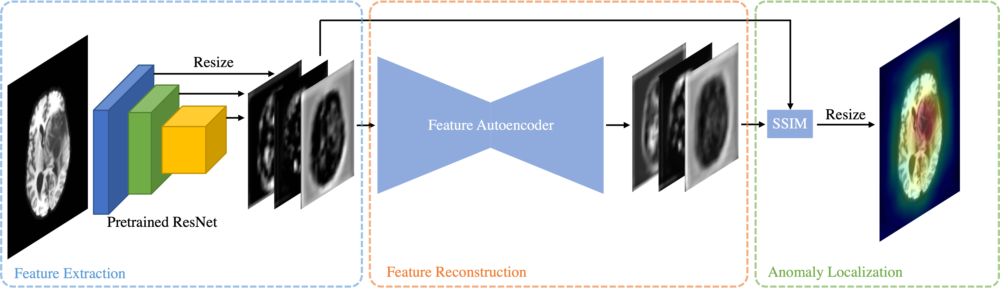
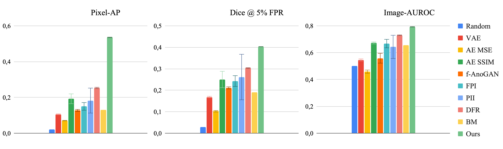
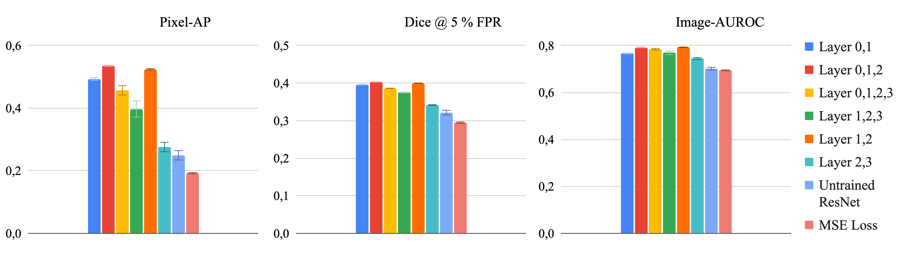

# Unsupervised Anomaly Localization with Structural Feature Autoencoders

This repository contains the code to reproduce the experiments from the paper “Unsupervised Anomaly Localization with Structural Feature Autoencoders”

In this work, we propose to combine working in a multi-channel feature space with Structural Similarity loss to significantly improve the localization performance of anomalies that are not necessarily hyperintense.



# Usage

Download this repository by running

```bash
git clone https://github.com/FeliMe/feature-autoencoder
```

in your terminal.

## Environment

Create and activate the Anaconda environment:

```bash
conda env create -f environment.yml
conda activate anomaly_detection
```

Additionally, you need to install the repository as a package:

```bash
python3 -m pip install --editable .
```

To be able to use [Weights & Biases](https://wandb.ai) for logging, set the environment variables $WANDBNAME and $WANDBPROJECT.

## Data

We use the Cambridge Centre for Ageing and Neuroscience (Cam-CAN) dataset for training ([https://camcan-archive.mrc-cbu.cam.ac.uk/dataaccess/index.php](https://camcan-archive.mrc-cbu.cam.ac.uk/dataaccess/index.php)) and the Multimodal Brain Tumor Image Segmentation Benchmark (BraTS) for evaluation ([ipp.cbica.upenn.edu](https://ipp.cbica.upenn.edu/) 2020 version).

You can preprocess the data by running

```bash
python3 fae/data/prepare_data.py --dataset CamCAN --weighting t1
python3 fae/data/prepare_data.py --dataset BraTS --weighting t1
```

## Run Experiments

To generate the results from Section 4.1 (Figure 4, Comparison with the Baselines), run:

```bash
bash fae/run_comparison.sh
```



To generate the results from Section 4.2 (Ablations), run:

```bash
bash fae/run_ablations.sh
```


